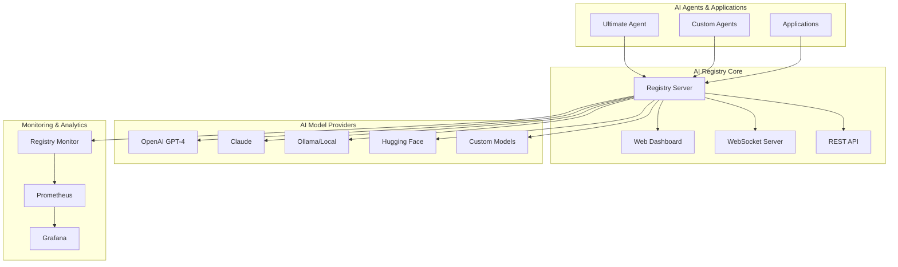

# 🧠 AI Model Registry - Complete System Documentation

> **The DNS for AI**: A comprehensive registry system that enables intelligent model discovery, seamless AI-to-AI communication, and distributed task processing across heterogeneous AI networks.

[](https://opensource.org/licenses/MIT)
[](https://nodejs.org/)
[](https://docker.com/)
[](https://developer.mozilla.org/en-US/docs/Web/API/WebSocket)

---

## 🎯 What This System Solves

In today's AI landscape, we have:
- **Fragmented AI ecosystems** with incompatible APIs and protocols
- **Manual model selection** without intelligent routing
- **No standardized discovery** mechanism for AI capabilities
- **Complex integration** requirements for multi-model workflows
- **Limited observability** into AI model performance and usage

**This registry transforms that chaos into an intelligent, self-organizing AI network.**

---

## 🌟 Key Features

### 🔍 **Intelligent Model Discovery**
- Find AI models by capabilities, performance metrics, and cost
- Automatic model scoring and ranking based on requirements
- Real-time availability and health monitoring
- Support for custom model metadata and tags

### 🔌 **Universal Protocol Translation**
- Seamless communication between OpenAI, Anthropic, Ollama, and custom models
- Automatic request/response format translation
- Streaming and non-streaming API support
- Authentication and security handling

### ⚡ **Smart Load Balancing & Failover**
- Intelligent task routing based on model load and performance
- Automatic failover chains with configurable retry logic
- Circuit breaker patterns for unreliable models
- Real-time performance monitoring and adaptive routing

### 📊 **Comprehensive Analytics & Monitoring**
- Real-time performance metrics and usage statistics
- Model benchmarking and comparative analysis
- Cost tracking and optimization recommendations
- Prometheus metrics export for external monitoring

### 🤖 **Agent Network Integration**
- Native integration with Ultimate Agent networks
- Multi-agent task orchestration and delegation
- Distributed processing across agent clusters
- Agent capability registration and discovery

### 🌐 **Production-Ready Features**
- Docker containerization with health checks
- WebSocket real-time updates
- REST API with comprehensive documentation
- Rate limiting and security controls
- Horizontal scaling support

---

## 🏗️ System Architecture



---

## 🚀 Quick Start Guide

### Option 1: Automated Setup (Recommended)

```bash
# Download and run the automated setup
curl -sSL https://raw.githubusercontent.com/your-org/ai-registry/main/setup-script.sh | bash

# Or manually download and run
wget https://raw.githubusercontent.com/your-org/ai-registry/main/setup-script.sh
chmod +x setup-script.sh
./setup-script.sh
```

### Option 2: Manual Installation

```bash
# 1. Clone or create the project directory
mkdir ai-model-registry && cd ai-model-registry

# 2. Copy all the source files from the artifacts:
#    - ai-registry-server.js
#    - ai-registry-client.js
#    - public/dashboard.html
#    - model-integrations.js
#    - registry-monitor.js
#    - usage-examples.js
#    - package.json

# 3. Install dependencies
npm install

# 4. Start the registry
npm start
```

### Option 3: Docker Deployment

```bash
# Using Docker Compose (production-ready)
docker-compose up -d

# View logs
docker-compose logs -f ai-registry

# Scale the registry
docker-compose up -d --scale ai-registry=3
```

---

## 🎮 Getting Started Tutorial

### Step 1: Start the Registry

```bash
# Start the registry server
npm start

# Verify it's running
curl http://localhost:3001/health
```

**Access Points:**
- **API**: http://localhost:3001
- **Dashboard**: http://localhost:3001/dashboard.html
- **Health Check**: http://localhost:3001/health
- **Metrics**: http://localhost:3001/metrics

### Step 2: Register Your First Models

#### Option A: Using the Web Dashboard
1. Open http://localhost:3001/dashboard.html
2. Use the preset buttons (OpenAI, Anthropic, Ollama, Local AI)
3. Fill in your API keys and configuration
4. Click "Add Model"

#### Option B: Using the API

```bash
# Register OpenAI GPT-4
curl -X POST http://localhost:3001/api/models/register \
  -H "Content-Type: application/json" \
  -d '{
    "name": "gpt-4",
    "type": "llm",
    "provider": "openai",
    "endpoint": "https://api.openai.com",
    "apiKey": "your-openai-api-key",
    "description": "OpenAI GPT-4 - Most capable model",
    "capabilities": ["text-generation", "reasoning", "code-generation"]
  }'

# Register local Ollama model
curl -X POST http://localhost:3001/api/models/register \
  -H "Content-Type: application/json" \
  -d '{
    "name": "llama2",
    "type": "llm",
    "provider": "ollama",
    "endpoint": "http://localhost:11434",
    "description": "Local Llama2 model via Ollama"
  }'
```

#### Option C: Auto-Registration from Configuration

```bash
# Create model-config.json with your API keys
node model-integrations.js auto-register

# Or register specific providers
node model-integrations.js register-openai your-openai-key
node model-integrations.js register-anthropic your-anthropic-key
node model-integrations.js register-ollama http://localhost:11434
```

### Step 3: Discover and Use Models

```javascript
const { AIRegistryClient } = require('./ai-registry-client');

// Initialize the registry client
const registry = new AIRegistryClient('http://localhost:3001');

// Find the best model for text generation
const model = await registry.discoverModel('text-generation', {
    maxLatency: 5000,      // Maximum acceptable latency
    minReliability: 0.9,   // Minimum reliability threshold
    maxCostPerToken: 0.01  // Maximum cost per token
});

if (model) {
    console.log(`Found model: ${model.name} by ${model.provider}`);
    
    // Create a client for the model
    const modelClient = await registry.createModelClient(model.id);
    
    // Query the model
    const response = await modelClient.query('Explain quantum computing in simple terms');
    console.log('Response:', response);
}
```

### Step 4: Integrate with Your Applications

```javascript
// Example: Multi-model task distribution
const { AITaskDistributor } = require('./usage-examples');

const distributor = new AITaskDistributor();

// Define tasks with different requirements
const tasks = [
    {
        id: 'blog-post',
        type: 'text-generation',
        description: 'Write a blog post about renewable energy',
        maxTokens: 800,
        priority: 'high'
    },
    {
        id: 'code-review',
        type: 'code-generation',
        description: 'Review and optimize this Python function',
        input: 'def slow_function(data): ...',
        language: 'python'
    },
    {
        id: 'translation',
        type: 'translation',
        input: 'Hello, how are you?',
        fromLanguage: 'English',
        toLanguage: 'Spanish'
    }
];

// Process all tasks with optimal model selection
for (const task of tasks) {
    const result = await distributor.routeTask(task);
    console.log(`✅ ${task.id} completed by ${result.modelUsed}`);
}
```

---

## 🔧 Integration with Ultimate Agent

### Adding Registry to Ultimate Agent

1. **Install the integration module**:

```python
# Add to your Ultimate Agent's requirements.txt
aiohttp>=3.8.0
```

2. **Update your agent configuration**:

```python
# In ultimate_agent/core/agent.py
from ai.registry_integration import integrate_registry

class UltimatePainNetworkAgent:
    def __init__(self, node_url=None, dashboard_port=8080):
        # ... existing initialization ...
        
        # Add registry integration
        if node_url:
            self.registry_integration = integrate_registry(self, 'http://localhost:3001')
```

3. **Use enhanced task delegation**:

```python
# Enhanced task processing with registry
async def process_complex_task(self, task_description, task_type=None):
    # Try to find external models that can help
    external_models = await self.discover_models(task_type)
    
    if external_models:
        # Delegate to the best external model
        best_model = external_models[0]
        result = await self.delegate_task(best_model.id, task_description)
        if result:
            return result
    
    # Fallback to local processing
    return await self.process_locally(task_description)
```

### Python Integration Example

```python
import asyncio
from ai.registry_integration import RegistryClient

async def main():
    async with RegistryClient('http://localhost:3001') as registry:
        # Register this agent
        await registry.register_agent({
            'name': 'data-analysis-agent',
            'type': 'specialist',
            'capabilities': ['data-analysis', 'visualization', 'reporting']
        })
        
        # Find models for different tasks
        text_models = await registry.find_models({'type': 'llm'})
        vision_models = await registry.find_models({'type': 'vision'})
        
        print(f"Found {len(text_models)} text models and {len(vision_models)} vision models")

asyncio.run(main())
```

---

## 📊 Real-World Usage Examples

### 1. Multi-Modal Content Pipeline

```javascript
const { AITaskDistributor } = require('./usage-examples');

async function createContentPipeline() {
    const distributor = new AITaskDistributor();
    
    // Step 1: Generate article
    const article = await distributor.routeTask({
        type: 'text-generation',
        description: 'Write an article about AI trends in 2024',
        maxTokens: 1000
    });
    
    // Step 2: Create summary
    const summary = await distributor.routeTask({
        type: 'summarization',
        input: article.result,
        style: 'executive'
    });
    
    // Step 3: Generate image
    const image = await distributor.routeTask({
        type: 'image-generation',
        description: 'Create an illustration for the AI trends article',
        style: 'professional'
    });
    
    return { article, summary, image };
}
```

### 2. Intelligent Agent Orchestration

```javascript
const { AgentOrchestrator } = require('./usage-examples');

async function setupAgentNetwork() {
    const orchestrator = new AgentOrchestrator();
    
    // Register agents with fallback chains
    await orchestrator.registerAgentWithFallbacks({
        id: 'primary-analyst',
        name: 'Data Analysis Agent',
        capabilities: ['data-analysis', 'visualization']
    }, ['openai', 'anthropic', 'local-llm']);
    
    // Execute critical analysis with automatic failover
    const result = await orchestrator.executeWithFallback('primary-analyst', {
        type: 'analysis',
        description: 'Analyze Q4 sales data and predict Q1 trends',
        data: salesData,
        priority: 'critical'
    });
    
    return result;
}
```

### 3. Model Performance Benchmarking

```javascript
const { ModelBenchmark } = require('./usage-examples');

async function runPerformanceAnalysis() {
    const benchmark = new ModelBenchmark();
    
    // Run comprehensive benchmark
    const report = await benchmark.runFullBenchmark();
    
    console.log(`Top performer: ${report.summary.topPerformer}`);
    console.log(`Average score: ${report.summary.averageScore}`);
    
    // Export results for further analysis
    await fs.writeFile('benchmark-report.json', JSON.stringify(report, null, 2));
    
    return report;
}
```

---

## 📡 Complete API Reference

### Core Registry Endpoints

#### Model Management
```http
POST /api/models/register        # Register a new model
GET  /api/models                # List all models
POST /api/models/find           # Find models by criteria
GET  /api/models/:id            # Get specific model details
GET  /api/models/:id/communication  # Get communication schema
PUT  /api/models/:id            # Update model configuration
DELETE /api/models/:id          # Remove model
```

#### Agent Management
```http
POST /api/agents/register       # Register an agent
GET  /api/agents               # List all agents
PUT  /api/agents/:id           # Update agent status
GET  /api/agents/:id/models    # Get agent's available models
```

#### Analytics & Monitoring
```http
GET  /api/stats                # Registry statistics
GET  /health                   # Health check
GET  /metrics                  # Prometheus metrics
GET  /api/performance          # Performance analytics
GET  /api/usage/:modelId       # Model usage statistics
```

### Client Library API

```javascript
const client = new AIRegistryClient('http://localhost:3001');

// Model discovery
const models = await client.findModels({ type: 'llm', provider: 'openai' });
const bestModel = await client.discoverModel('text-generation');

// Model communication
const communication = await client.getModelCommunication(modelId);
const modelClient = await client.createModelClient(modelId);
const response = await modelClient.query('Hello world');

// Agent registration
await client.registerAgent({
    name: 'my-agent',
    capabilities: ['processing', 'analysis']
});

// Statistics
const stats = await client.getStats();
```

### WebSocket Events

```javascript
// Connect to real-time updates
const ws = new WebSocket('ws://localhost:3001');

ws.onmessage = (event) => {
    const message = JSON.parse(event.data);
    
    switch (message.event) {
        case 'model_registered':
            console.log('New model registered:', message.data);
            break;
        case 'model_updated':
            console.log('Model updated:', message.data);
            break;
        case 'agent_connected':
            console.log('Agent connected:', message.data);
            break;
    }
};
```

---

## 🔍 Monitoring & Analytics

### Built-in Monitoring Features

- **📊 Real-time Metrics**: Request counts, response times, error rates
- **🎯 Model Usage Tracking**: Per-model statistics and performance
- **🤖 Agent Activity**: Registration, heartbeats, and task distribution
- **💾 System Health**: Memory, CPU, and resource utilization
- **📈 Performance Analytics**: Percentiles, trends, and optimization insights

### Prometheus Integration

```bash
# Access metrics endpoint
curl http://localhost:3001/metrics

# Sample metrics output
registry_requests_total 1247
registry_models_active 12
registry_agents_total 5
registry_response_time_avg 245.7
registry_error_rate 0.02
```

### Grafana Dashboards

Create dashboards to visualize:
- Request volume and response times over time
- Model usage distribution and performance comparisons
- Error rates and system health indicators
- Agent connectivity and task distribution patterns
- Cost analysis and optimization opportunities

### Monitoring CLI Tools

```bash
# Real-time status
node registry-monitor.js status

# Generate daily report
node registry-monitor.js report > daily-report.json

# Performance analytics
node registry-monitor.js performance

# Export Prometheus metrics
node registry-monitor.js metrics
```

---

## 🔒 Security & Production Deployment

### Security Features

#### API Security
- **Rate Limiting**: Configurable per IP and endpoint
- **CORS Protection**: Customizable origin restrictions
- **Request Validation**: Schema validation and sanitization
- **API Key Authentication**: Optional admin and user keys

#### Data Protection
- **Sensitive Data Masking**: API keys are never logged or exposed
- **Encryption**: Optional AES-256 encryption for stored data
- **SSL/TLS**: HTTPS support with certificate management
- **Secure WebSocket**: WSS support for encrypted real-time updates

### Production Configuration

```yaml
# docker-compose.prod.yml
version: '3.8'
services:
  ai-registry:
    image: ai-registry:latest
    environment:
      - NODE_ENV=production
      - PORT=3001
      - SSL_ENABLED=true
      - SSL_CERT_PATH=/etc/ssl/cert.pem
      - SSL_KEY_PATH=/etc/ssl/key.pem
      - ADMIN_API_KEY=${ADMIN_API_KEY}
      - DB_CONNECTION_STRING=${DB_CONNECTION_STRING}
    volumes:
      - ./ssl:/etc/ssl:ro
      - ./data:/app/data
    deploy:
      replicas: 3
      resources:
        limits:
          memory: 512M
          cpus: '0.5'
```

### Load Balancer Configuration (Nginx)

```nginx
upstream ai_registry {
    server registry-1:3001;
    server registry-2:3001;
    server registry-3:3001;
}

server {
    listen 443 ssl http2;
    server_name ai-registry.yourdomain.com;
    
    ssl_certificate /path/to/ssl/cert.pem;
    ssl_certificate_key /path/to/ssl/key.pem;
    
    location / {
        proxy_pass http://ai_registry;
        proxy_http_version 1.1;
        proxy_set_header Upgrade $http_upgrade;
        proxy_set_header Connection 'upgrade';
        proxy_set_header Host $host;
        proxy_set_header X-Real-IP $remote_addr;
        proxy_set_header X-Forwarded-For $proxy_add_x_forwarded_for;
        proxy_set_header X-Forwarded-Proto $scheme;
        proxy_cache_bypass $http_upgrade;
    }
}
```

---

## 🛠️ Development & Customization

### Development Setup

```bash
# Clone the repository
git clone https://github.com/your-org/ai-registry.git
cd ai-registry

# Install dependencies
npm install

# Start in development mode with auto-reload
npm run dev

# Run tests
npm test

# Lint code
npm run lint
```

### Adding Custom Model Providers

1. **Extend ModelIntegrations**:

```javascript
// In model-integrations.js
async registerCustomProvider(apiKey, models) {
    for (const modelConfig of models) {
        const model = {
            name: modelConfig.name,
            type: modelConfig.type,
            provider: 'custom-provider',
            endpoint: modelConfig.endpoint,
            apiKey: apiKey,
            communicationSchema: {
                requestFormat: 'custom-format',
                responseFormat: 'custom-format',
                authMethod: 'api-key'
            }
        };
        
        await this.registryClient.registerModel(model);
    }
}
```

2. **Update Client Library**:

```javascript
// In ai-registry-client.js - ModelClient class
buildRequest(prompt, options) {
    const format = this.schema.requestFormat;
    
    switch (format) {
        case 'custom-format':
            return {
                input: prompt,
                parameters: options,
                model: this.name
            };
        // ... existing cases
    }
}

parseResponse(response) {
    const format = this.schema.responseFormat;
    
    switch (format) {
        case 'custom-format':
            return response.output || response.text;
        // ... existing cases
    }
}
```

### Custom Agent Integration

```python
# Python example for custom agents
class CustomAIAgent:
    def __init__(self, registry_url='http://localhost:3001'):
        self.registry = RegistryClient(registry_url)
        
    async def initialize(self):
        # Register with registry
        await self.registry.register_agent({
            'name': 'custom-processor',
            'type': 'specialized',
            'capabilities': ['custom-task-type'],
            'endpoint': 'http://localhost:9000'
        })
        
    async def process_task(self, task):
        # Find suitable models
        models = await self.registry.find_models({
            'capability': task.type,
            'maxLatency': 5000
        })
        
        if models:
            # Delegate to best model
            best_model = models[0]
            result = await self.delegate_to_model(best_model, task)
            return result
            
        # Fallback to local processing
        return await self.process_locally(task)
```

### Environment Configuration

```bash
# .env file for development
NODE_ENV=development
PORT=3001
REGISTRY_DATA_FILE=./ai-registry-data.json

# Database configuration (optional)
DB_TYPE=postgresql
DB_HOST=localhost
DB_PORT=5432
DB_NAME=ai_registry
DB_USER=registry_user
DB_PASSWORD=secure_password

# API Keys for model providers
OPENAI_API_KEY=sk-your-openai-key
ANTHROPIC_API_KEY=your-anthropic-key
HUGGINGFACE_API_TOKEN=your-hf-token

# Security settings
ADMIN_API_KEY=your-admin-key
JWT_SECRET=your-jwt-secret
CORS_ORIGINS=http://localhost:3000,http://localhost:8080

# Monitoring
PROMETHEUS_ENABLED=true
LOG_LEVEL=info
METRICS_RETENTION_DAYS=30
```

---

## 🔧 Troubleshooting Guide

### Common Issues and Solutions

#### 1. Connection Refused Errors
```bash
# Check if registry is running
curl http://localhost:3001/health

# Check logs for errors
docker-compose logs ai-registry

# Verify port availability
netstat -tulpn | grep 3001
```

#### 2. Models Not Being Discovered
```bash
# Verify model registration
curl http://localhost:3001/api/models

# Check model health
node model-integrations.js health-check

# Test model communication
curl http://localhost:3001/api/models/MODEL_ID/communication
```

#### 3. WebSocket Connection Issues
- **Firewall**: Ensure port 3001 is accessible
- **Proxy**: Configure proxy to support WebSocket upgrades
- **CORS**: Verify WebSocket origins are allowed

#### 4. High Latency or Timeouts
```bash
# Check model performance
node usage-examples.js benchmark

# Monitor system resources
node registry-monitor.js status

# Analyze request patterns
curl http://localhost:3001/api/performance
```

#### 5. Memory or Performance Issues
```bash
# Enable debug logging
DEBUG=* npm start

# Monitor resource usage
top -p $(pgrep -f "ai-registry-server")

# Check for memory leaks
node --inspect ai-registry-server.js
```

### Debug Mode

```bash
# Enable detailed logging
LOG_LEVEL=debug npm start

# Enable Node.js inspector
node --inspect=0.0.0.0:9229 ai-registry-server.js

# Enable performance profiling
node --prof ai-registry-server.js
```

### Performance Optimization

1. **Enable Redis Caching**:
```javascript
const redis = require('redis');
const client = redis.createClient();

// Use Redis for model discovery caching
```

2. **Database Connection Pooling**:
```javascript
// Configure connection pool settings
const poolConfig = {
    min: 2,
    max: 10,
    acquireTimeoutMillis: 60000,
    createTimeoutMillis: 30000,
    destroyTimeoutMillis: 5000,
    idleTimeoutMillis: 30000,
    reapIntervalMillis: 1000
};
```

3. **Enable Response Compression**:
```javascript
const compression = require('compression');
app.use(compression());
```

---

## 📈 Performance Metrics & KPIs

### Target Performance Indicators

| Metric | Target | Description |
|--------|--------|-------------|
| **Model Discovery Time** | < 100ms | Time to find and rank suitable models |
| **Task Routing Time** | < 200ms | Time to route task to optimal model |
| **API Response Time** | < 500ms | Average API endpoint response time |
| **System Uptime** | > 99.9% | Registry availability percentage |
| **Error Rate** | < 1% | Percentage of failed requests |
| **WebSocket Latency** | < 50ms | Real-time update delivery time |

### Monitoring Dashboards

Create comprehensive monitoring with:

1. **System Health Dashboard**:
   - Request volume and response times
   - Error rates and status code distribution
   - Memory and CPU utilization
   - Database connection health

2. **Model Performance Dashboard**:
   - Model usage statistics and trends
   - Response time comparisons
   - Success/failure rates per model
   - Cost analysis and optimization

3. **Agent Activity Dashboard**:
   - Connected agents and their status
   - Task distribution patterns
   - Agent performance metrics
   - Network topology visualization

---

## 🤝 Contributing & Community

### How to Contribute

1. **Fork the Repository**
2. **Create a Feature Branch**: `git checkout -b feature/amazing-feature`
3. **Make Your Changes** and add comprehensive tests
4. **Follow Code Standards**: Run `npm run lint` and `npm test`
5. **Commit Changes**: `git commit -m 'Add amazing feature'`
6. **Push to Branch**: `git push origin feature/amazing-feature`
7. **Open a Pull Request** with detailed description

### Development Guidelines

- **Code Style**: Follow ESLint configuration
- **Testing**: Maintain >80% test coverage
- **Documentation**: Update README and API docs
- **Backwards Compatibility**: Ensure compatibility with existing integrations
- **Performance**: Benchmark changes that affect core functionality

### Community Resources

- **Issues**: [GitHub Issues](https://github.com/your-org/ai-registry/issues)
- **Discussions**: [GitHub Discussions](https://github.com/your-org/ai-registry/discussions)
- **Discord**: [Community Discord Server](https://discord.gg/ai-registry)
- **Documentation**: [Comprehensive Docs](https://ai-registry.docs)
- **Examples**: [Example Repository](https://github.com/your-org/ai-registry-examples)

---

## 📚 Additional Resources

### Example Projects

- **[E-commerce AI Assistant](https://github.com/examples/ecommerce-ai)**: Multi-model customer service bot
- **[Content Creation Pipeline](https://github.com/examples/content-pipeline)**: Automated content generation workflow
- **[Data Analysis Platform](https://github.com/examples/data-analysis)**: Multi-agent data processing system
- **[Code Review Bot](https://github.com/examples/code-review)**: Automated code analysis and suggestions

### Integration Guides

- **[Kubernetes Deployment](docs/k8s-deployment.md)**: Scalable container orchestration
- **[AWS Integration](docs/aws-integration.md)**: Deploy on AWS with auto-scaling
- **[Google Cloud Setup](docs/gcp-setup.md)**: GCP deployment with managed services
- **[Azure Configuration](docs/azure-config.md)**: Azure deployment and monitoring

### Best Practices

- **[Model Selection Strategies](docs/model-selection.md)**: How to choose optimal models
- **[Security Hardening](docs/security.md)**: Production security checklist
- **[Performance Tuning](docs/performance.md)**: Optimization techniques
- **[Monitoring Setup](docs/monitoring.md)**: Comprehensive observability

---

## 🎯 Roadmap & Future Development

### Short-term Goals (Next 3 months)
- [ ] **Enhanced Model Metadata**: Support for model versioning and A/B testing
- [ ] **Advanced Routing**: ML-based model selection and load prediction
- [ ] **Cost Optimization**: Automatic cost tracking and budget management
- [ ] **Integration Templates**: Pre-built integrations for popular frameworks

### Medium-term Goals (3-6 months)
- [ ] **Distributed Registry**: Multi-region registry synchronization
- [ ] **Advanced Analytics**: Predictive performance modeling
- [ ] **Workflow Engine**: Visual workflow builder for complex AI pipelines
- [ ] **Enterprise Features**: RBAC, audit logs, compliance reporting

### Long-term Vision (6+ months)
- [ ] **Federated Learning**: Support for collaborative model training
- [ ] **Auto-scaling Models**: Dynamic model deployment based on demand
- [ ] **AI Marketplace**: Economic incentives for model sharing
- [ ] **Cross-Platform SDK**: Native clients for Python, Go, Java, .NET

---

## 📄 License & Legal

This project is licensed under the **MIT License** - see the [LICENSE](LICENSE) file for details.

### Third-Party Licenses
- Express.js: MIT License
- WebSocket (ws): MIT License
- UUID: MIT License
- CORS: MIT License

### Commercial Use
This software is free for both personal and commercial use. Attribution is appreciated but not required.

### Disclaimer
This software is provided "as is" without warranty of any kind. Users are responsible for ensuring compliance with AI provider terms of service and applicable regulations.

---

## 🙏 Acknowledgments

### Inspiration & References
- **DNS System Design**: Inspired by the hierarchical and distributed nature of DNS
- **Service Discovery Patterns**: Based on microservices discovery mechanisms
- **AI Research Community**: Built for and with the AI agent development community

### Contributors
- **Ultimate Agent Team**: Core development and integration
- **AI Research Community**: Feature requests and testing
- **Open Source Contributors**: Bug fixes and enhancements

### Special Thanks
- **Anthropic**: For Claude's assistance in system design and documentation
- **OpenAI**: For GPT model integration patterns
- **Ollama Team**: For local model deployment inspiration
- **WebSocket Community**: For real-time communication standards

---

## 📞 Support & Contact

### Getting Help

1. **Documentation**: Start with this README and the integration guides
2. **GitHub Issues**: For bugs, feature requests, and technical questions
3. **Community Discord**: For real-time help and discussions
4. **Stack Overflow**: Tag questions with `ai-registry`

### Commercial Support

Enterprise support available for:
- Custom integration development
- Performance optimization consulting
- Security audits and compliance
- Training and implementation services

**Contact**: [enterprise@ai-registry.com](mailto:enterprise@ai-registry.com)

### Security Issues

Report security vulnerabilities privately to: [security@ai-registry.com](mailto:security@ai-registry.com)

We follow responsible disclosure practices and will acknowledge security reports within 24 hours.

---

## 🎉 Quick Success Metrics

After setting up the AI Registry, you should achieve:

✅ **Model Discovery**: Find suitable models in <100ms  
✅ **Task Routing**: Intelligent model selection based on requirements  
✅ **Failover**: Automatic fallback when models are unavailable  
✅ **Monitoring**: Real-time visibility into model performance  
✅ **Integration**: Seamless connection with your existing AI agents  
✅ **Scalability**: Handle increasing load with horizontal scaling  

**Ready to transform your AI infrastructure? Let's build the future of AI-to-AI communication! 🚀**

---

*Made with ❤️ for the AI agent community. Star ⭐ this repository if it helps your AI projects!*